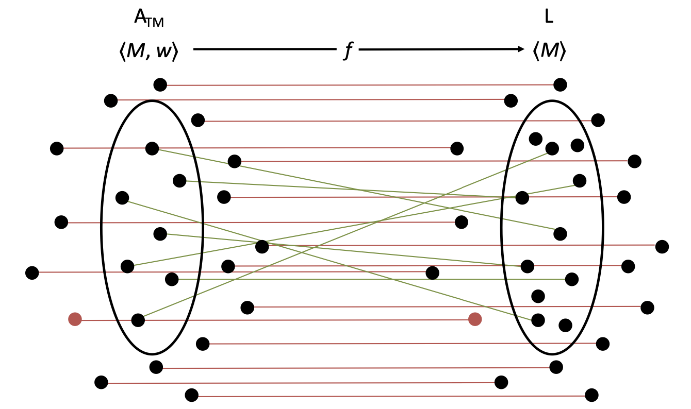

# October 11th: Mapping Reductions

## Reviewing Reductions

1. **Opening Statement**: What are you reducing from?
2. **Initial Assumption**: Some L is decidable, hence $\text{D}_\text{L}$
3. **Build** $\text{D}_\text{A}\langle M, w \rangle$
   - Build $M'$ from $\langle M, w \rangle$
   - Run $\text{D}_\text{L} \langle M' \rangle$
   - DWID or DTO
4. **Case 1**: $\langle M, w \rangle \in \text{A}_\text{TM}$ &rarr; $q_\text{accept}$
5. **Case 2**: $\langle M, w \rangle \notin \text{A}_\text{TM}$ &rarr; $q_\text{reject}$
6. **Conclusion**: L is undecidable

## Mapping

We are going to focus on defining a mapping of $\langle M, w \rangle$ to $M'$, then just drop the other nonsense that isn't really necessary.

So the old-school reduction framework becomes:

1. **Opening Statement**: What are you reducing from?
2. **Computable Function**: Some Turing Machine that takes an input $\langle M, w \rangle$ and converts it into the output $\langle M' \rangle$
3. **Case 1**: $\langle M, w \rangle \in \text{A}_\text{TM}$ &rarr; $\langle M' \rangle \in \text{L}$
4. **Case 2**: $\langle M, w \rangle \notin \text{A}_\text{TM}$ &rarr; $\langle M' \rangle \notin \text{L}$
5. **Conclusion**: L is undecidable

The core of this is that 2nd step with the computable function. We need to map every machine/input combo that is in $\text{A}_\text{TM}$ to some machine that is in L and every machine/input combo that is not in $\text{A}_\text{TM}$ to some machine that is not in L.

We can also state this formally by saying $\text{A}_\text{TM}$ is "mapping reducable" to L. Symbolically:

$$\text{A}_\text{TM} \leq _m \text{L}$$

More generally, we can define this relationship between _any_ two languages.

$$\text{L}_2 \leq _m \text{L}_1$$

- If $\text{L}_1$ is decidable, so is $\text{L}_2$.
- If $\text{L}_2$ is undecidable, so is $\text{L}_1$.
- If $\text{L}_1$ is recognizable, so is $\text{L}_2$.
- If $\text{L}_2$ is unrecognizable, so is $\text{L}_1$.

## Examples

### $\text{HALT}_\text{TM}$

**Mapping Reduction**: $\text{A}_\text{TM} \leq _m \text{HALT}_\text{TM}$

Create a computable function $f$ that, on input $\langle M, w \rangle$:

1. Construct the following $M'$
   - Run $M$ on $w$
   - If $M$ accepts $w$, **accept**
   - If $M$ rejects $w$, **reject**
2. Output $\langle M', 1 \rangle$

**Cases**:

$\langle M, w \rangle \in \text{A}_\text{TM}$ In this case $M$ accepts $w$, which means that $M'$ will accept and halt on input 1. Thus the pair $\langle M', 1 \rangle \in \text{HALT}_\text{TM}$.

$\langle M, w \rangle \notin \text{A}_\text{TM}$ In this case $M$ rejects or loops $w$, which means that $M'$ will loop on input 1 and never halt. Thus the pair $\langle M', 1 \rangle \notin \text{HALT}_\text{TM}$.

### $\text{101}_\text{TM}$

**Mapping Reduction**: $\text{A}_\text{TM} \leq _m 101_\text{TM}$

Create computable function $f$ that, on input $\langle M, w \rangle$:

1. Construct the following Machine $M'$
   - Run $M$ on $w$
   - If $M$ accepts $w$, **accept**
   - If $M$ rejects $w$, **reject**
2. Output $\langle M' \rangle$

**Cases**:

$\langle M, w \rangle \in \text{A}_\text{TM}$ In this case $M$ accepts $w$, which means that $M'$ will accept any input, including 101. Thus $\langle M' \rangle \in 101_\text{TM}$.

$\langle M, w \rangle \notin \text{A}_\text{TM}$ In this case $M$ rejects or loops $w$, which means that $M'$ will loop and never accept any input, including 101. Thus $\langle M' \rangle \notin 101_\text{TM}$.

### $\text{E}_\text{TM}$

**Mapping Reduction**: $\text{A}_\text{TM} \leq _m \overline{\text{E}}_\text{TM}$

Create computable function $f$ that, on input $\langle M, w \rangle$:

1. Construct the following Machine $M'$
   - Run $M$ on $w$
   - If $M$ accepts $w$, **accept**
   - If $M$ rejects $w$, **reject**
2. Output $\langle M' \rangle$

**Cases**:

$\langle M, w \rangle \in \text{A}_\text{TM}$ In this case $M$ accepts $w$, which means that $M'$ will accept any input. Thus $\langle M' \rangle \in \overline{\text{E}}_\text{TM}$.

$\langle M, w \rangle \notin \text{A}_\text{TM}$ In this case $M$ rejects or loops $w$, which means that $M'$ will loop and never accept any input. Thus $\langle M' \rangle \notin \overline{\text{E}}_\text{TM}$.

&nbsp;

Since $\overline{\text{E}}_\text{TM}$ is undecidable, its compliment $\text{E}_\text{TM}$ is also undecidable.

## From the Quiz

$$\text{L} = \{\langle M \rangle \mid M \text{ is a TM that accepts every input of length } 5\}$$

**Mapping Reduction**: $\text{A}_\text{TM} \leq _m \overline{\text{E}}_\text{TM}$

Create computable function $f$ that, on input $\langle M, w \rangle$:

1. Construct the following Machine $M'$
   - Run $M$ on $w$
   - If $M$ accepts $w$, **accept**
   - If $M$ rejects $w$, **reject**
2. Output $\langle M' \rangle$

**Cases**:

$\langle M, w \rangle \in \text{A}_\text{TM}$ In this case $M$ accepts $w$, which means that $M'$ will accept any input. Thus $\langle M' \rangle \in \text{L}$.

$\langle M, w \rangle \notin \text{A}_\text{TM}$ In this case $M$ rejects or loops $w$, which means that $M'$ will loop and never accept any input. Thus $\langle M' \rangle \notin \text{L}$.
