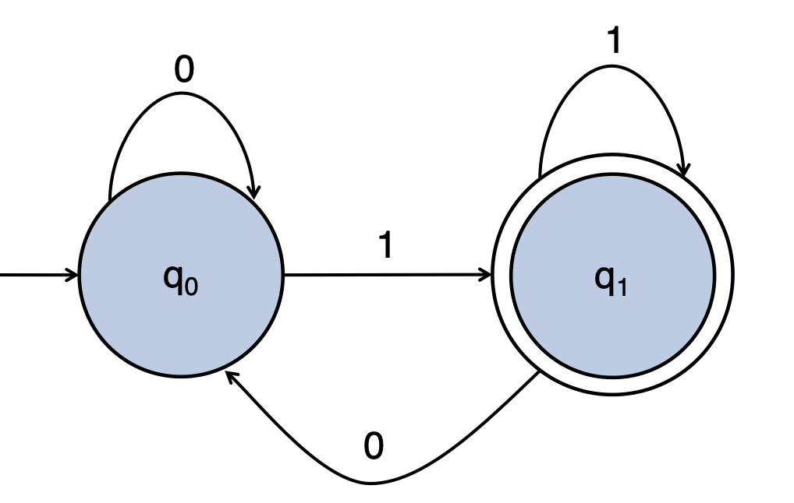
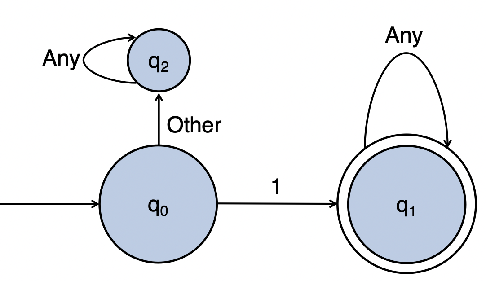
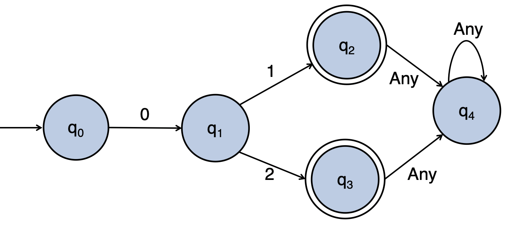
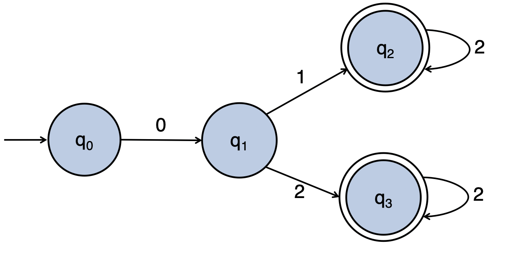
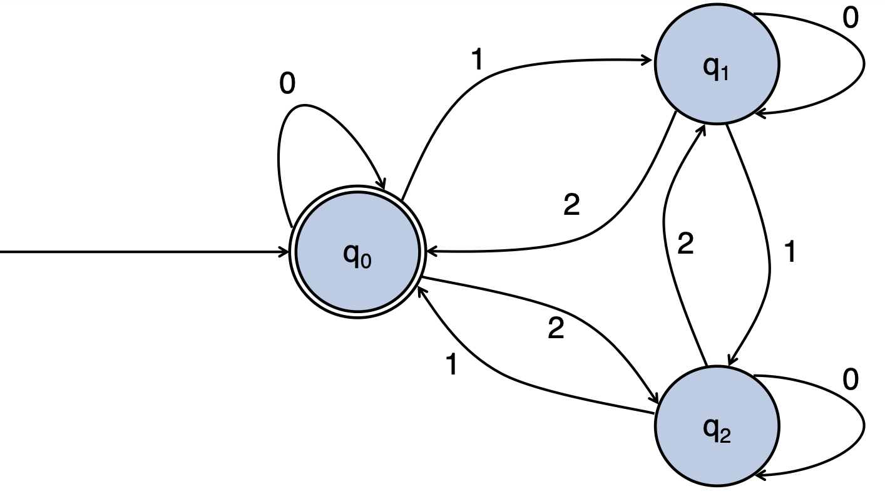
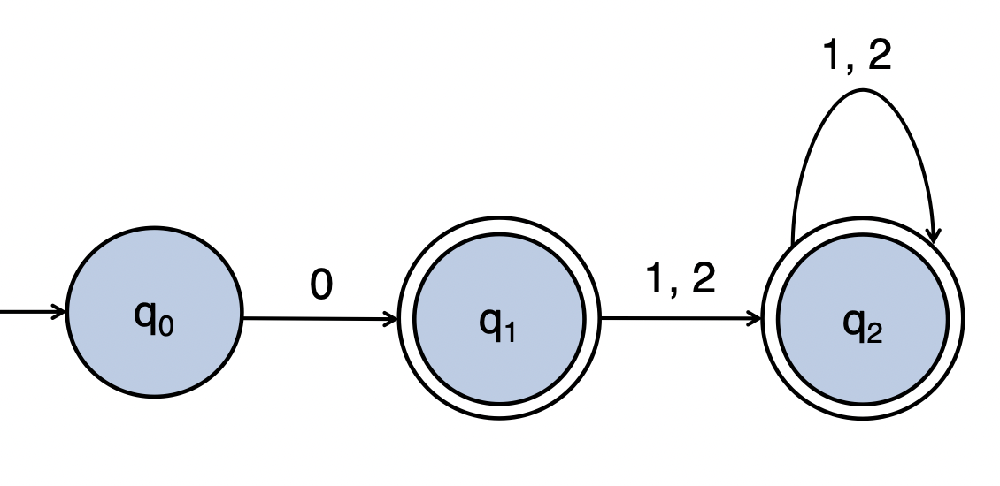
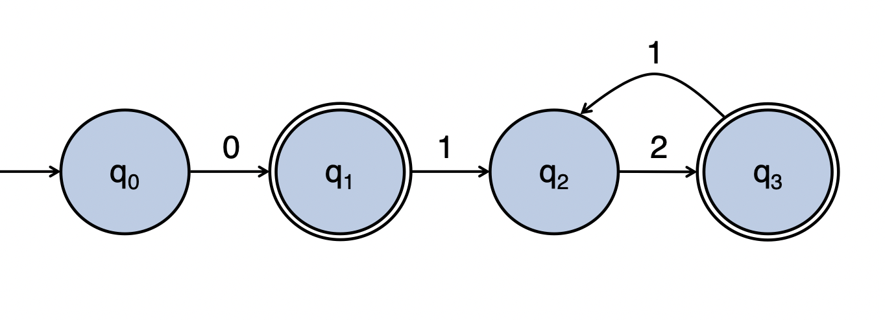
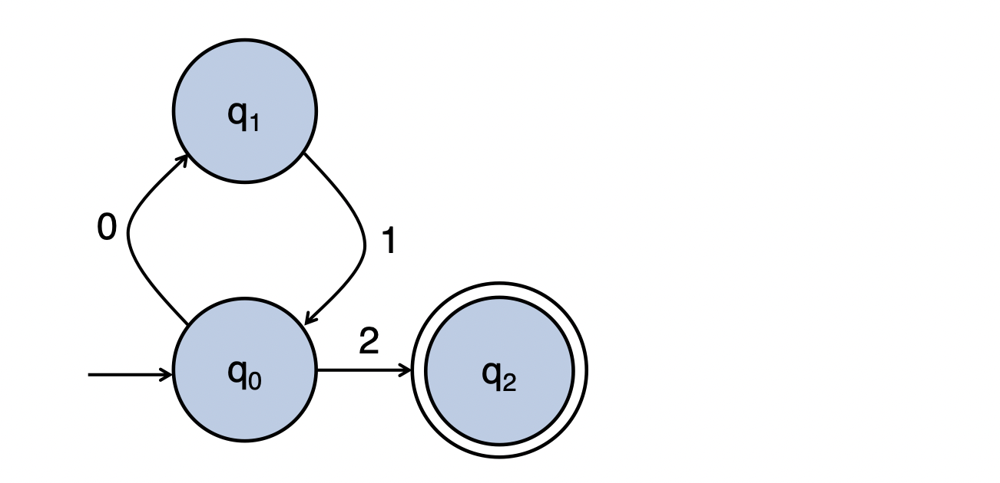
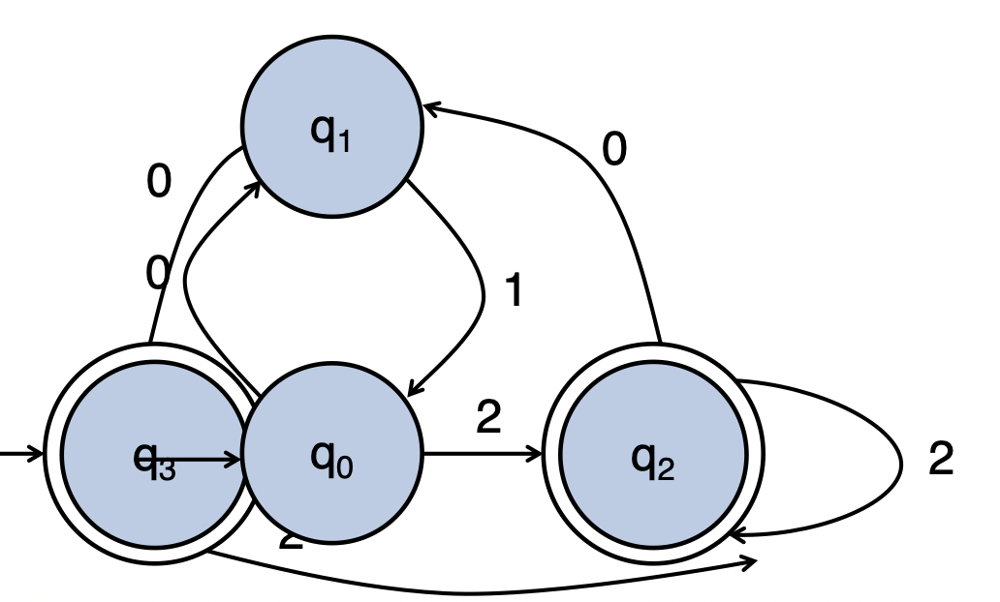

# October 13th: Finite State Automata

## From Turing Machine to Finite State Automata

We can only move to the right. What does this imply?

- It no longer makes any sense to print anything because we'll never go back to read it
- Don't need to specify moving right because we do it every time

## Specifying FSAs

$$L = \{w \mid w \text{ ends with } 1\}$$

We can write out the FSA in the normal way but we can also do a pretty diagram:

We specify a FSA with a 5-tuple:

- $Q$ is the set of states
- $q_0 \in Q$ is the initial state
- $\Sigma$ is the input alphabet
- $\delta$ is the transition function
- $q_\text{accept} \in Q$ is the accept state(s)

It's important to note that FSAs reject _by default_. If we do not enter $q_\text{accept}$, we implicitly reject.

\pagebreak

How about:

$$L = \{ w \mid w \text{ starts with } 1\}$$

Or:

$$L = \{\text{0 [1 2]}\}$$

\pagebreak

Or:

$$L = \{\text{0 [1 2] } 2^n \mid n \geq 0 \}$$

Or:

$$L = \{\text{[0 1 2]}^n \mid \text{ the digits sum to a multiple of 3 } (n \geq 0) \}$$

If we want to build the compliment of this, we just switch the accept states to be not accept states and vice versa.

\pagebreak

Ok, so lets introduce a new symbology: if square brackets mean "choose one", parentheces mean "this thing exactly".

The $*$ means "0 or more times". $+$ means "1 or more times"

Example...

$$L = \{\text{0 [1 2]}*\}$$

If we replace the square brackets with parentheces...

$$L = \{\text{0 (1 2)}*\}$$

\pagebreak

Something even more advanced...

$$L = \{\text{(0 1)}*2\}$$

Wow...is this too much?

$$L = \{(\text{(0 1)}*2)*\}$$

If a language can be recognized by a FSA, the language is regular. We express regular languages using Regular Expressions.

\pagebreak

We can also use FSAs to generate strings in a language.

Regular Languages are closed under...

1. **Star** $L_{\text{A*}} = \{x_1 x_2 ... x_n \mid x_i \in L_\text{A}\}$
2. **Union** $L_{\text{A} \cup \text{B}} = \{x \mid x \in L_\text{A} \lor x \in L_\text{B}\}$
3. **Concatenation** $L_{\text{A} \cdot \text{B}} = \{xy \mid x \in L_\text{A} \land y \in L_\text{B}\}$
