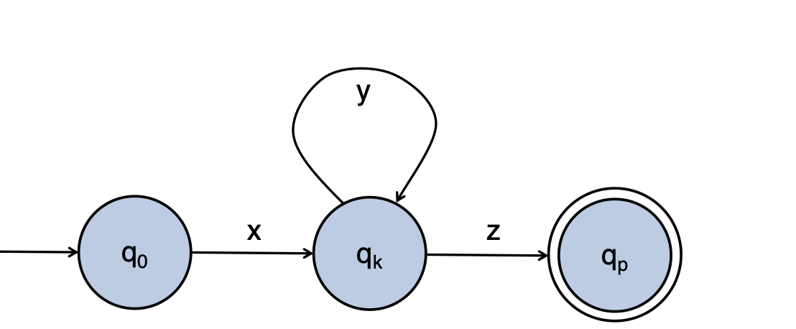

# October 18th: The Pumping Lemma

## What languages are "regular"

### Building Intuition

We can't simulate an FSA with another FSA

We can do things like determining if something is a URL, or if a section of code is a comment, determine if a word is contained in a dictionary.

### A negative example

$$L = \{w \mid w \text{ is of the form } 0^n 1^n\}$$

An FSA is **finite**, meaning that it has a finite number of states. $L$ has an **infinite** number of valid examples.

Assume the FSA has $p$ states, and the input is $0^p 1^p$. So we if we are traversing the entire input string, we are going to need to loop at some point, otherwise we don't have enough states.

In a picture...

So, we must first run the $x$ section, then run the $y$ section as many times as we want, then run the $z$ section once. To link this back to the language, we have an $x$ section, followed by some number of $y$ sections, followed by a $z$ section.

There's no section in $L$ that we can repeat...sad cs boy hours :(

## The Pumping Lemma

> If $L$ is a regular language then there is a number $p$, such that any input string longer than $p$ can be split into sections $x$, $y$, and $z$, such that:
>
> 1. For each $i \geq 0$, $xy^iz \in L$
> 2. $\mid y \mid > 0$
> 3. $\mid xy \mid \leq p$

### Example

$$L = \{ww \mid w \in \{0,1\}^*\}$$

1. Assume $L$ is regluar and thus has a pumping length $p$
2. Let the input be $0^p10^p1$ ($w = 0^p1$)
3. $0^p10^p1 = xyz$, so where do we put $y$?

Thus by the Pumping Lemma we know that $y$ must appear in the first $p$ characters, and when $y$ appears there it creates strings not in the language $L$. Thus we are broken. $\Rightarrow \Leftarrow$
