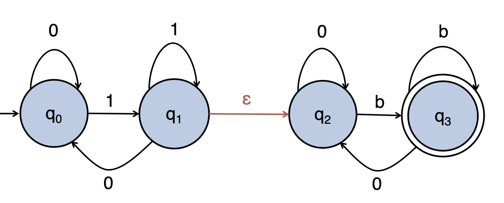

# October 20th: Nondeterministic Finite State Automata

## The problem we are trying to solve

If we are concatenating two regular languages that share a symbol in their language, we end up with this really sad thing where one state/symbol combination might need to go to one of two states.

Also we need to do a bit of renaming with our acronyms. We have two types of Finite State Automata (FSA), the Determinstic FSA (DFA) and the Nondeterministic FSA (NFA).

## What makes NFAs different?

### Same state/symbol &rarr; multiple states

In those weird cases we can go along both paths at the same time, and if either accept then we accep the whole string.

Importantly, from any NFA, we can construct an analygous DFA. In a general sense, if we have an NFA with $k$ states, we can construct an analygous DFA with $2^k$ states.

### $\epsilon$ transition

A transition that doesn't move the automata and can happen at any time.

This is kinda neat becase we can very simply do concatenations and unions. But remember, we can always convert it back to a DFA.
