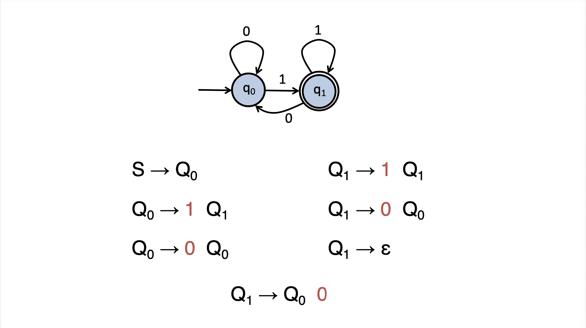
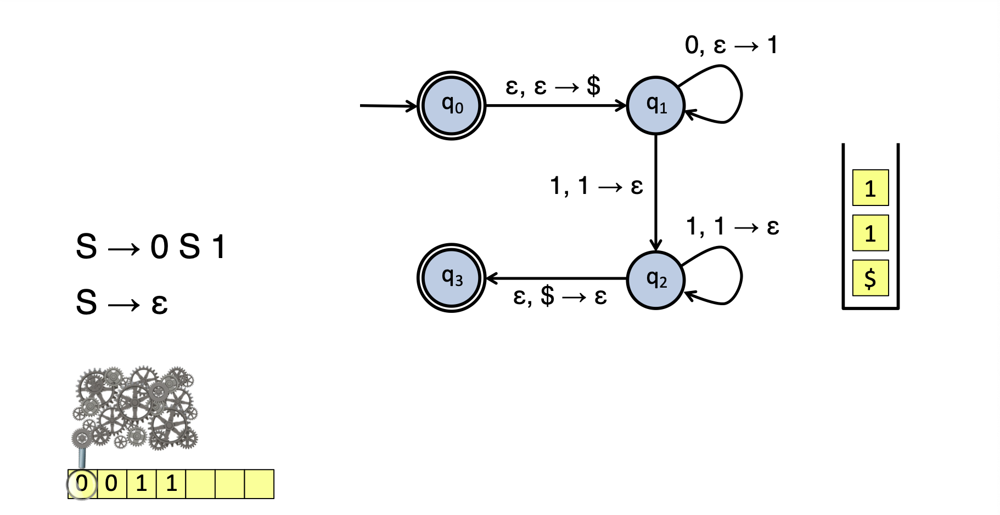

# October 27th: Context Free Grammars

## Representation

4-tuple...

| Symbol    | Thing                                                              |
| --------- | ------------------------------------------------------------------ |
| V         | a finite set of variables or "non-tterminals"                      |
| $\Sigma$  | a finite set of terminals                                          |
| R         | a finite set of rules mapping variables to variables and terminals |
| S $\in$ V | is the start variable                                              |

When writing the rules, we can also map from a variable to $\epsilon$, which means the "empty string"

### Example

$$L = \{w \mid w \text{ is of the form } 0^n1^n\}$$

becomes
S &rarr; 0 S 1
S &rarr; $\epsilon$

### Visually, from an FSA to a CFG

\pagebreak

## Power

Ok so we clearly have more power in the CFG, where does that power come from? We get a stack where we can put data, in addition to on the tape.

Awesome. So how do we use this?

## Closure

### Star

$L_A = S_A$ \
$L_{A*} =$

- $S$ &rarr; $S_A$ S
- $S$ &rarr; $\epsilon$

### Union

$L_A = S_A$ \
$L_B = S_B$ \
$L_{A \cup B} =$

- $S$ &rarr; $S_A$
- $S$ &rarr; $S_B$

### Concatenation

$L_A = S_A$ \
$L_B = S_B$ \
$L_{AB} = S$ &rarr; $S_AS_B$

## Chomsky Normal Form

Limits the size of our "rule"s to exactly one terminal character or two other rules.

### Example

S0 &rarr; S \
S &rarr; A S A | a B \
A &rarr; B | S \
B &rarr; b | $\epsilon$

becomes

S0 &rarr; S \
S &rarr; A S A | a B | a \
A &rarr; B | S | $\epsilon$ \
B &rarr; b

becomes

S0 &rarr; S \
S &rarr; A S A | a B | a | SA | AS \
A &rarr; b | S \
B &rarr; b

becomes

S0 &rarr; ASA | a B | a | SA | AS \
S &rarr; A S A | a B | a | SA | AS \
A &rarr; b | ASA | a B | a | SA | AS \
B &rarr; b

becomes

S0 &rarr; AD | CB | a | SA | AS \
S &rarr; AD | CB | a | SA | AS | AS \
A &rarr; b | AD | CB | a | SA | AS \
B &rarr; b \
C &rarr; a \
D &rarr; SA

### CYK Algorithm
