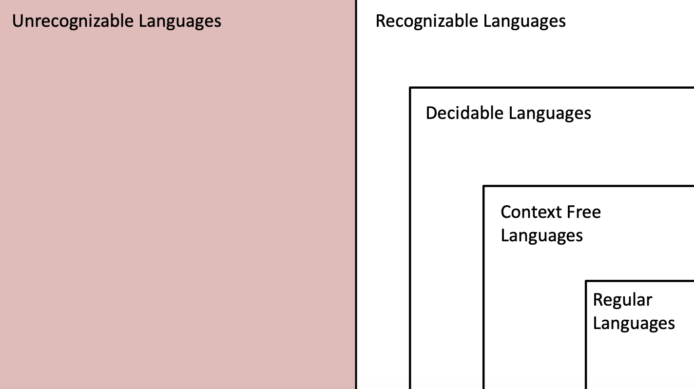

# November 1st: Context Free Grammars Continued

## More Pumping (CFG-specific)

If $L$ is a context free language then there is a number $p$, such that any input string longer than $p$ can be split into five sections $s = uvxyz$ such that:

1. For each $i \geq 0$, $uv^ixy^iz \in L$
2. $|vy| > 0$
3. $|vxy| \leq p$

In CNF, eventually we are going to hit the same rule more than once, there must be some sort of "loop" somewhere.

### Example 1

$$L = \{a^nb^nc^n \mid n \geq 0\}$$

1. Assume $L$ is context free and thus has pumping length $p$.
2. Let the input be $a^pb^pc^p$
3. $a^pb^pc^p = uvxyz$, wo where do we put $v$ and $y$?

Ok well it's gotta be some nonzero number of characters, so it might be entirely in $a$, or in $b$, or in $c$. None of those work because then the $p$'s wouldn't match. It could also go on the boarder between $a$ and $b$, in which case the number of $c$'s wouldn't match. The same for between $b$ and $c$.

### Example 2

$$L = \{ ww \mid w \in \{0, 1\}* \}$$

Ok same assumptions as before. 

1. Assume $L$ is context free and thus has pumping length $p$.
2. Let the input be $0^p1^p0^p1^p$
3. $0^p1^p0^p1^p = uvxyz$, wo where do we put $v$ and $y$?

So we have some number like:

$$0000111100001111$$

We can either pump a $0$ or a $1$, which doesn't work, but we also can't encapsulate an entire group of $0$'s or $1$'s in $v$ or $y$ because they are too big.

## CFG &rarr; TM

If we want to move from a Context-Free-Grammar to a Turing Machine, we add another stack.

The crazy thing is that we don't have a way to model computation at a higher power than the Turing Machine without going to something crazy like Quantom.

\pagebreak

## Review

Remember, if something is regular, it is also context-free, decidable, and recognizable.
