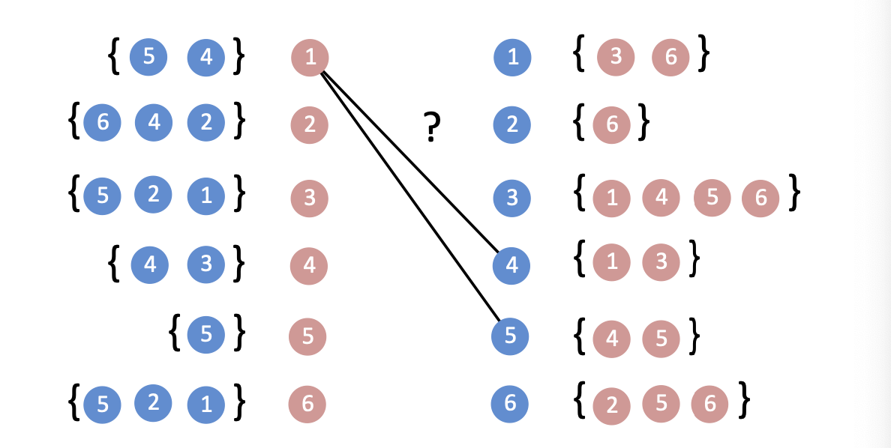

# November 3rd: P vs NP

## Sudoku

Megan asks where Skylar is.

Defining the Sudoku deciding language:

$$L_D = \{\langle s \rangle \mid s \text{ is an instance of Sudoku and } s \text{ has a solution}\}$$

or even something a little more fun like the verification language

$$L_V \{\langle s, c \rangle \mid s \text{ is an instance of Sudoku and } c \text{ is a solution to } s\}$$

To decide $L_D$ we would need to generate candidate solutions, then run $D_{L_V}$ on the candidates. Deciding $L_V$ is much easier

## NP

The class NP is the class of all problems that are:

* Verifiable in deterministic polynomial time
* Decidable in non-deterministic polynomial time

## The Marriage Problem

So we need to figure out if the blue and pink circles can pair up and make a purple circle.

We can construct $L_D$ and $L_V$ as above. And these two algorithms, if constructed as we did for the Sudoku time, have the same time complexity as the Sudoku problem.

BUT, there is a better way!

We can actually do a greedy matching algorithm where we go forward until we find someone that can't match. Then we follow the unused edges and work through the lists, going back and forth. This is called an "M-augmenting" path.

### Hall's Marriage Theorem:

> If $M$ is a maximum matching in graph $G$, there can be no M-augmenting path.

Leads to

> M-augmenting paths can be found in polynomial time via breadth-first search.

So, this means that we actually can construct a deterministic polynomial time algorithm that decides the Marriage Problem.

## P

The class P is the class of all problems that are:

* Verifiable in deterministic polynomial time
* Decidable in deterministic polynomial time

Important note: P is a subset of NP!

But... is P = NP? If you've got an answer you can be very rich.

## The Travelling Salesman

We know this one.

The decider problem isn't really interesting because it is always possible. How about the verification problem?

A verification algorithm for this problem will take exponential time.

## EXPTIME

The class EXPTIME is the class of all problems that are:

* Decision problems that can be solved in exponential time.

Note:    NP is a subset of EXPTIME
