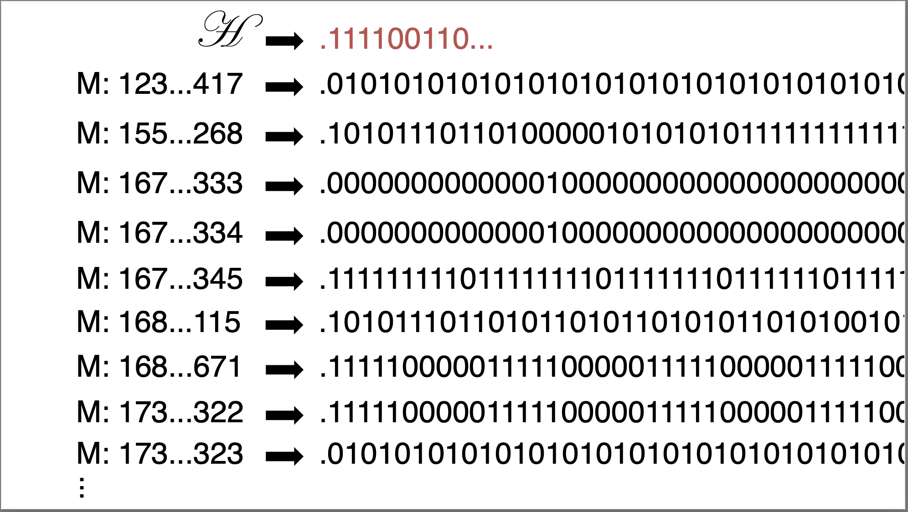
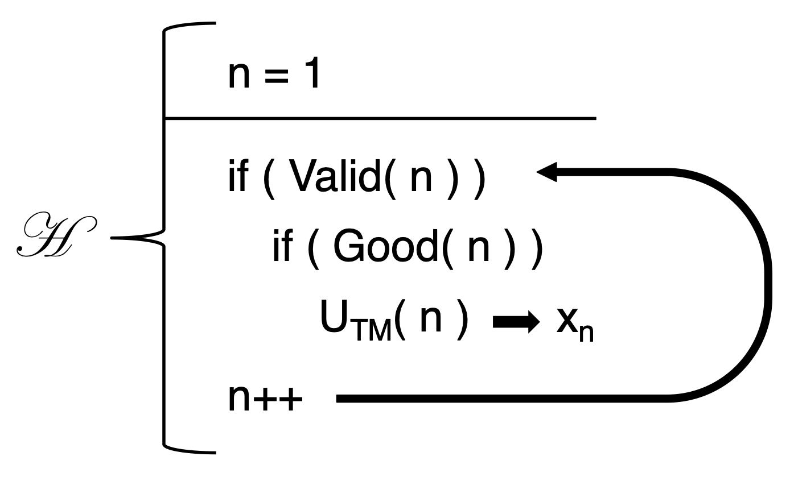

# September 22nd: The Universal Turing Machine (contd.)

## The Unprintable Number

If we line up all the correct Machines, ordered by their Machine description numbers, along with the infinitely long numbers.

We can then diagonalize:

We call the Turing Machine that prints that number $\mathscr{H}$. The machine does the following:

1. Checks the syntactic validitity of the Machine at $n$
2. Checks if the Turing Machine at $n$ prints a number to infinte precision
3. Simulates the Machine with $U_{TM}(n)$ until we reach the $n$ th digit.

But, but but but. The Machine $\mathscr{H}$ is well-formed, so it will appear on the list of all valid Machines. If the machine appears on the list, then eventually $\mathscr{H}$ will have to evaluate $\mathscr{H}$ to find the number at $\mathscr{H}$'s index.

This is an infinite recursive loop.

So, if $\mathscr{H}$ is a well-formed Machine, $\mathscr{H}$ cannot print the number, so it is not well-formed.

But, if $\mathscr{H}$ is not well-formed, then it doesn't appear on the list of all good Machines, so $\mathscr{H}$ can print the number, so it ***is*** well-formed. 

$$\Longrightarrow \Longleftarrow$$

## Decidable

So...

> There is no general decision procedure for determining if a machine is good from its description.

Furthermore,

> There is no general decision procedure for determining if a formula in first order logic is a theorem.

Finally, the axoims are neither:

* Complete
* Consistent
* Decidable

:(
