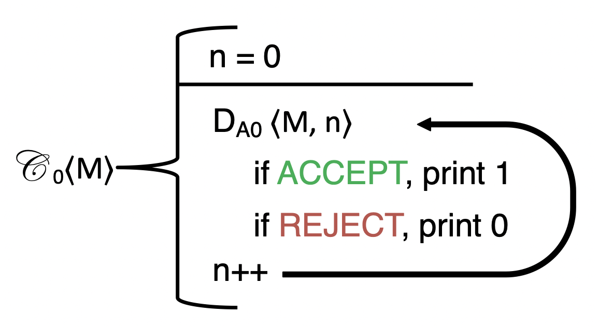

# September 27th: Decidability

## What is Decidability?

> A decider is a Turing Machine that starts with input on the tape, and *decides* wheather or not it has a certain property

I.E., a *decider* is a Turing Machine that decides a *language*.

We can specify a language with a syntax like the following:
```
Start_1 = { w | w begins with the symbol 1 } 
```
meaning everything that starts with 1

```
Palindrome = {w | w is a palindrome }
```

A *language* is a group of strings that share a property, kinda like a set of strings. We can also specify something more interesting:
```
Valid_TM = { <w> | M is a valid Turing Machine }
Good_TM  = { <M> | M is a good  Turing Machine }
```

All of these are *decidable* languages, except for the `Good_TM`, which is not decidable.

## Expanding the Turing Machine Definition to Deciders

So far we have the following 5-tuple:

* $Q$ is the set of states
* $q_0$ is in $Q$ and is the inital state
* $\Gamma$ is the tape alphabet
* $\delta$ is the transition function
* $\Sigma$ is the input alphabet (not including the special blank symbol)

We must add the following 2 elements to the definition of a Turing Machine to define deciders

* $q_{accept}$ is in $Q$ and is the accept state[s]
* $q_{reject}$ is in $Q$ and is the reject state[s]

So if we define the "good" language as $L$, it is not possible to build the decider $D_L$.

If the `Good_TM` isn't decidable (we already proved this), then `Bad_TM` is also undecidable.

## Finding More Undecidable Languages

1. Take some new language $L$
2. Assume that it is decidable and thus has a decider $D_L$
3. Show that $D_L$ would allow you to build $D_{Good}$

Consider the following decider:

$$\mathscr{E}_0 = \{ <M> | M \text{ prints a 0 at some point} \}$$

We will prove by reduction from `Good_TM` to `Everprint_0`

Define this new decider, `Anotherprint_0`:

$$\mathscr{H}_0 = \{ <M, x> | M \text{ prints another 0 after the } x^{\text{th}} 0 \}$$

Which is equivalent to 

$$\mathscr{H}_0 = \{ <M, 0> | M \text{ prints another 0 after the } 0^{\text{th}} 0 \}$$

$$\mathscr{H}_1 = \{ <M, 1> | M \text{ prints another 0 after the } 1^{\text{th}} 0 \}$$

If we take `Everprint_0` and remove its ability to print that first 0, then pass it back to `Everprint_0` 

We can then define the Turing Machine: 



It prints 1 for digit x of its output if M will print another 0 after it has printed the xth 0, and 0 otherwise.

$$\mathscr{I}_0 = { <M> | M \text{ prints an infinte number of 0's}}$$

If $M$ ever stops printing 0s, $\mathscr{C}_0$ will print an infinite stream of 0s. Until that point, it will print a stream of 1s.

$$D_{IO} = \lnot D_{E0}<\mathscr{C}<M>>$$ 

So we can decide for `everprint` and `infinprint`. 

Let's build $D_{\text{Good}} from these other deciders:

$$D_{\text{Good}}<M> = D_{\text{I0}} \lor D_{\text{I1}}<M>$$

$D_{\text{Good}}<M>$ can not be constructed.

$$\Longrightarrow \Longleftarrow$$

So these `everprint`, `anotherprint`, and `infiniprint` languages are all undecidable.

So now if we want to show that a language is undecidable, we can prove by reduction to one of these languages.

See the [EverPrintTM](http://www.cs.tufts.edu/comp/170/resources/docs/EverPrintTM.pdf) for an example of this kind of proof.
