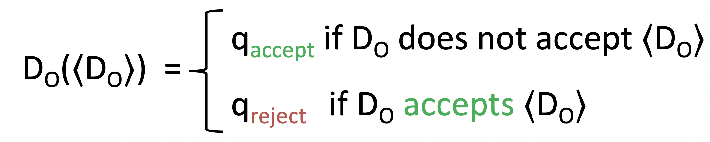
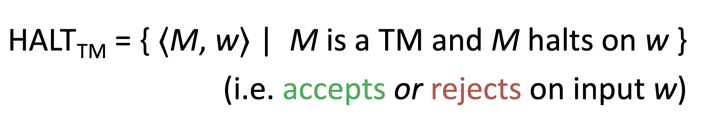
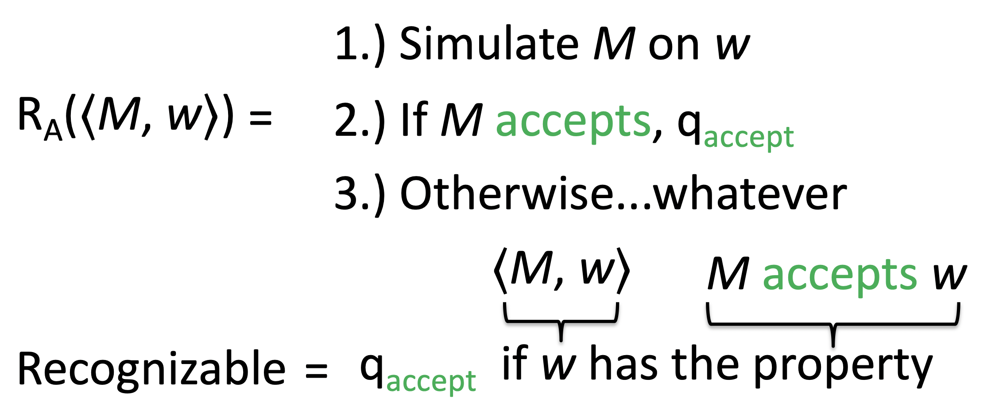

# September 29th: The Halting Problem

## What is Decidability?

Consider a machine that might do something at some point or might never do that thing. If we make a machine that tries to determine if the first machine will ever do that thing, it might have to run forever. That is undecidability.

Consider the following Turing Machine:

$$L_1 = \{01^n | n > 0\}$$

This is decidable, because $n$ is finite.

Or this one:

$$L_2 = \{ \Sigma ^n | n = 5 \}$$

This one is super easy because it's just string-len.

Or this one:

$$L_3 = \{\Sigma ^n 111 | n \geq 0\}$$

That one is easy enough, just check that the string ends with three 1s.

These "languages" are really just sets of strings, so we can perform set operations as follows:

$$L_4 = L_3 - L_2$$

or

$$L_5 = L_2 \bigcup L_3$$

These are both decidable because their component languages are decidable.

## Evaluating Deciders

We are going to consider the Turing Machine that accepts both a Turing Machine and that Turing Machine's input.

$$A_{TM} = \{ < M, w > | M \text{ is a TM and } M \text{ accepts } w \}$$

We accept the tuple if $M$ accepts $w$. We reject the tuple if $M$ rejects $w$, or if $M$ errors out, or of $M$ infinitely loops.

We want to see the world burn so let's just plug $M$ in as the Turing Machine, then pass the Machine as the input string.

If we define that input Turing Machine to be the Turing Machine that evaulates a Turing Machine that takes a Turing Machine as an input, then take the inverse of that Machine, we get the very painful Turing Machine:

Which totally breaks down and is meaningless. So, our list of undecidable languages is expanded:

- Good_TM
- Bad_TM
- Everprint_0,1
- Anotherprint_0,1
- Infiniteprint_0,1
- A_TM

## The Halting Problem

### Setup

We are evaluating the decidability of the following language:

We will prove this is undecidable by reduction from A_TM to HALT_TM.

Assume HALT_TM is decidable. Thus there exists a Turing Machine, D_HALT, that can decide HALT_TM.

We will now build a decider for ATM that takes input ⟨M, w⟩ and determines if M accepts w. This decider will be constructed as follows...

### Reduction

A Turing Machine D_A that decides A_TM:

1. Run D_HALT on the input <M, w>
2. If D_HALT rejects that input, we reject as well
3. If D_HALT accepts, we simulate M on w until it halts
   - If M accepts, we accept
   - Otherwise, we reject

(more detail in [slides](http://www.cs.tufts.edu/comp/170/schedule/lectures/07-Halting.pdf))

### Conclusion

Thus we can construct a decider for A_TM using a decider for HALT_TM.

### Result

So, our list of undecidable languages is expanded:

- Good_TM
- Bad_TM
- Everprint_0,1
- Anotherprint_0,1
- Infiniteprint_0,1
- A_TM
- HALT_TM

## Recognizability

A recognizer's only gaurentee is that it will accept languages that have the property. We do not care what happens if the langauge doesn't have the property.

This is a smaller problem than that which a decider tries to solve.

There are more recognizable languages than there are decidable languages. Additionally, all decidable languages are recognizable.

Consider the compliment case:

If a language L is recognizable, and its compliment -L is recognizable, then both L and -L are decidable.

We can build a decider from two recognizers by running both of them incrementally, so that both recognizers are able to run without either one of them entering an infinite loop.

### Unrecognizable Languages

- -A_TM
- -HALT_TM
- -Everprint_0,1
- Good_TM
- Bad_TM
